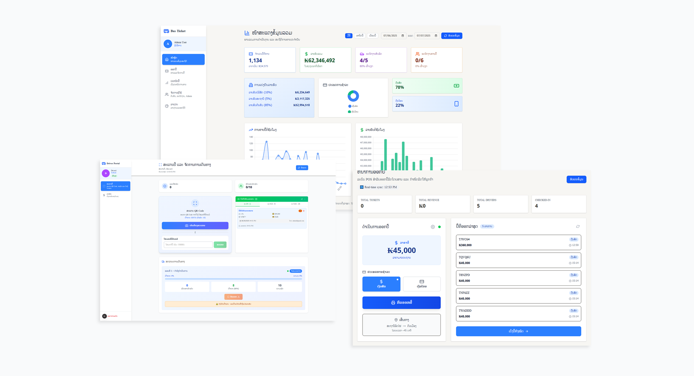
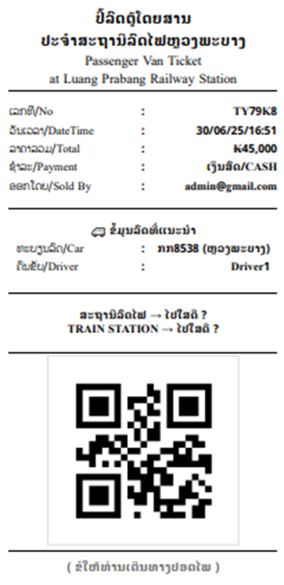

#Ticketing for Passenger Van

This project is my final university project before graduation.  
Its functionality is quite straightforward:

- ✅ Issue tickets similar to a POS system.
- 🚐 Allow pre-selection of which van will be assigned to a trip.
- 📲 Include a scanning system for drivers to count the number of passengers boarding.
- 👨‍💼 Feature an employee check-in system to track work attendance.
- 💰 Include a revenue-sharing system based on actual task contributions.

## 🛠 Technologies Used

- Next.js
- TypeScript
- Tailwind CSS
- MongoDB